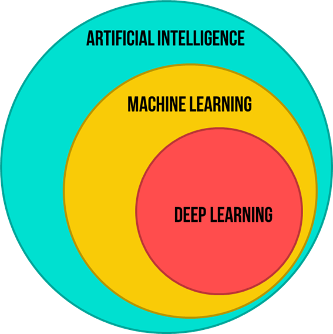

# AI vs ML vs DL
## ML is a subset of AI and DL is a subset of ML, in short AI is a broader term and contains both ML and DL. 

### What is an AI?

It is concerned with building smart and intelligent machines.

- **Non-intelligent machines :**
  - Bike
  - Watch
- **Intelligent machines :**
  - Google Assistant
  - Tesla

### What is ML?

It is a technique to implement AI that can learn from data by themselves without programming them.

- Detecting the images of two different personalities  
**Procedure :**  
We feed numerous images of both personalities. The algorithm is designed to analyze both images, find patterns or differences between them, and provide a prediction based on new input images.

### What is DL?

DL uses ANN *(Artificial Neural Networks)* to learn from the data.

- There are a lot of neurons just like our brain. As each neuron process the data it sends the output to the next neuron.
