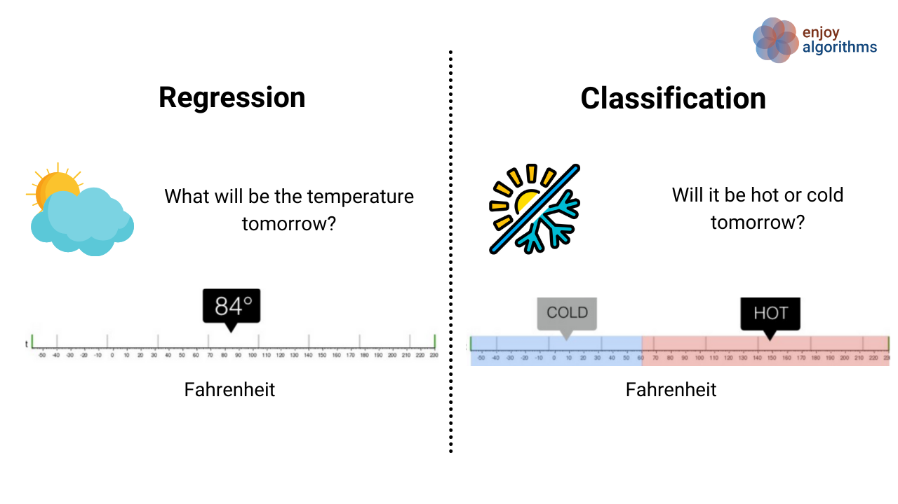

# Types of Supervised Learning

**Classification** :
It is about predicting a class or discrete values.

- Male or female
- True or False
- Dog or Cat

**Regression** :
It is about predicting a quantity or continuous values.

- Salary
- Age
- Rainfall in cm according to current temperature

## Classsification Algorithms :

1. Decision Tree Classification
2. Random Forest Classification
3. K-nearest Neighbour

## Regression Algorithms :

1. Logistic Regression
2. Polynomial Regression
3. Support Vector Machines
