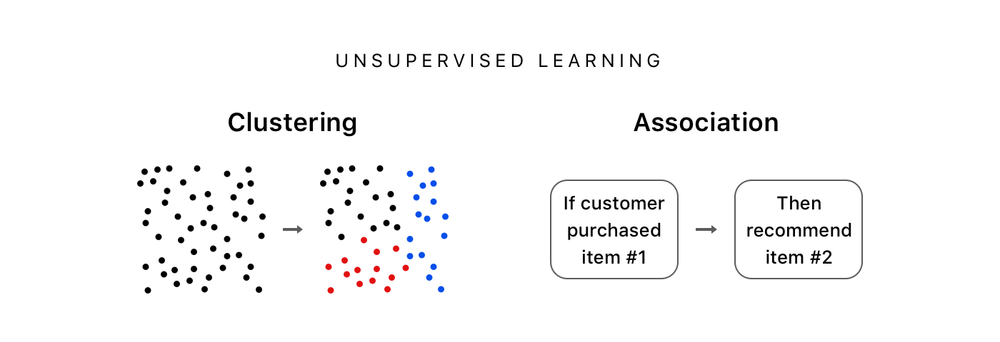

# Types of Unsupervised Learning

**Clustering** : 
It is an unspervised task which involves grouping the similar data points.

- Apples and Mangoes - It tries to find relations between same images
- Finding similar customers from E-commerce company and divide them into several clusters.

**Association** : 
It is an unspervised task which involves finding important relationships between data points.

- Netflix Shows Recommendations - Watching Avengers gives you superhero movies recommendations. Someone before you had already watched such kind of thing so algotihm trains itself to find the relation with your feed too.

## Clustering Algorithms : 

1. K-Means Clustering
2. Hierarchical Clustering
3. Principal Component Analysis (PCA)

## Association Algorithms : 

1. Apriori
2. Eclat