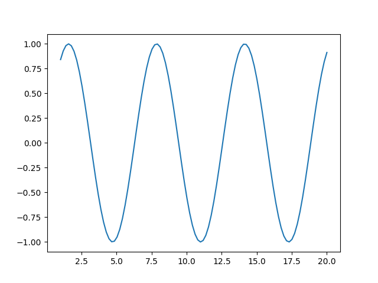
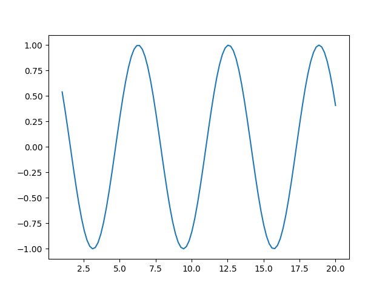
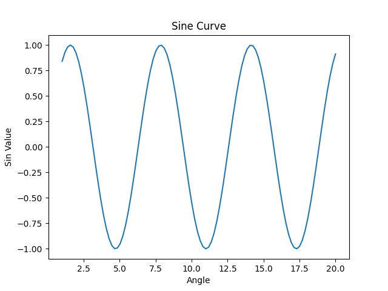
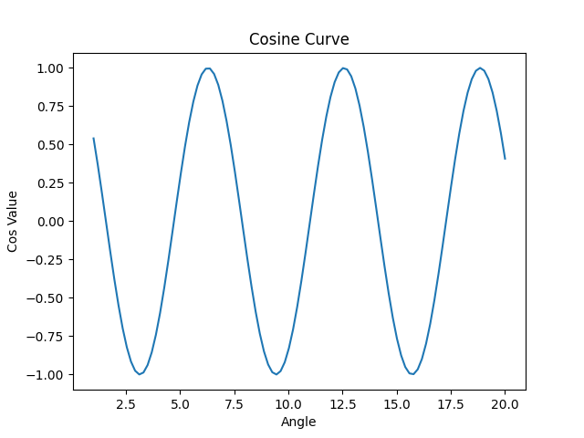
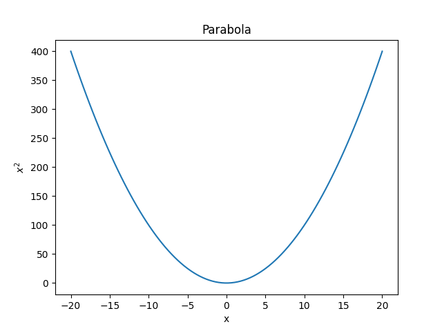

# Matplotlib

### Advantages :

1.  Useful for making plots

### Importing Matplotlib

```python
import matplotlib.pyplot as plt
```

## Plotting sin and cos curves

To plot the values we assign the values to the curve using numpy library

```python
import numpy as np

x = np.linspace(1,20,100)
sin_term = np.sin(x)
cos_term = np.cos(x)

print(f"Equally spaced values between 1 and 20\n{x} \n\n Sin values of the x values\n{sin_term} \n\n Cos values of the x values \n{cos_term}")
```

#### Output

    Equally spaced values between 1 and 20
    [ 1.          1.19191919  1.38383838  1.57575758  1.76767677  1.95959596
    2.15151515  2.34343434  2.53535354  2.72727273  2.91919192  3.11111111
    3.3030303   3.49494949  3.68686869  3.87878788  4.07070707  4.26262626
    4.45454545  4.64646465  4.83838384  5.03030303  5.22222222  5.41414141
    5.60606061  5.7979798   5.98989899  6.18181818  6.37373737  6.56565657
    6.75757576  6.94949495  7.14141414  7.33333333  7.52525253  7.71717172
    7.90909091  8.1010101   8.29292929  8.48484848  8.67676768  8.86868687
    9.06060606  9.25252525  9.44444444  9.63636364  9.82828283 10.02020202
    10.21212121 10.4040404  10.5959596  10.78787879 10.97979798 11.17171717
    11.36363636 11.55555556 11.74747475 11.93939394 12.13131313 12.32323232
    12.51515152 12.70707071 12.8989899  13.09090909 13.28282828 13.47474747
    13.66666667 13.85858586 14.05050505 14.24242424 14.43434343 14.62626263
    14.81818182 15.01010101 15.2020202  15.39393939 15.58585859 15.77777778
    15.96969697 16.16161616 16.35353535 16.54545455 16.73737374 16.92929293
    17.12121212 17.31313131 17.50505051 17.6969697  17.88888889 18.08080808
    18.27272727 18.46464646 18.65656566 18.84848485 19.04040404 19.23232323
    19.42424242 19.61616162 19.80808081 20.        ]

    Sin values of the x values
    [ 0.84147098  0.92908054  0.98257421  0.99998769  0.98068157  0.92536476
    0.8360685   0.71607176  0.56978082  0.40256749  0.22057186  0.03047682
    -0.16073733 -0.34604919 -0.51865411 -0.67221402 -0.8010902  -0.90055029
    -0.96694212 -0.99782778 -0.99207314 -0.94988952 -0.8728259  -0.76371206
    -0.62655467 -0.46639016 -0.28909977 -0.10119362  0.09042837  0.27872982
    0.45679629  0.61808918  0.7566858   0.86749687  0.9464534   0.99065611
    0.99848187  0.96964331  0.9051994   0.8075165   0.68018156  0.52787031
    0.35617562  0.17140215 -0.01966522 -0.21001048 -0.39264414 -0.56085989
    -0.70848083 -0.83008631 -0.92121097 -0.97850871 -0.99987556 -0.98452691
    -0.93302638 -0.84726506 -0.73039212 -0.58669914 -0.42146253 -0.24074979
    -0.05119671  0.14023632  0.32651987  0.50081358  0.6567174   0.78850651
    0.89134161  0.9614466   0.99624721  0.99446556  0.95616708  0.88275809
    0.77693417  0.64258118  0.48463257  0.30888823  0.12180149 -0.06975781
    -0.2587556  -0.43825186 -0.60165549 -0.7429663  -0.85699534 -0.93955546
    -0.98761505 -0.99940935 -0.97450528 -0.91381733 -0.81957394 -0.69523575
    -0.54536847 -0.37547522 -0.1917945  -0.00107107  0.18969168  0.37348895
    0.54357168  0.69369443  0.81834467  0.91294525]

    Cos values of the x values
    [ 0.54030231  0.36987747  0.18587071 -0.00496123 -0.19561099 -0.37907791
    -0.54862507 -0.69802667 -0.8217967  -0.91539031 -0.97537073 -0.99953547
    -0.98699722 -0.93821637 -0.85498416 -0.74035688 -0.59854365 -0.43475186
    -0.25499596 -0.06587659  0.12566177  0.31258582  0.4880317   0.64555703
    0.77937747  0.88457912  0.95729897  0.99486675  0.99590296  0.96036956
    0.88957133  0.78610798  0.65377871  0.49744264  0.32284045  0.13638354
    -0.05508138 -0.24452372 -0.42498712 -0.58984498 -0.73304369 -0.84932499
    -0.93441903 -0.98520115 -0.99980662 -0.97769914 -0.91969048 -0.82791074
    -0.70573006 -0.55763493 -0.38906342 -0.20620548 -0.01577565  0.17523345
    0.35980797  0.53117033  0.68302807  0.80980499  0.90684582  0.97058721
    0.99868859  0.99011806  0.94519034  0.86555517  0.75413677  0.61502642
    0.45333226  0.27499171  0.08655346 -0.10506305 -0.29282163 -0.46982779
    -0.62958184 -0.76621761 -0.87471782 -0.95109835 -0.99255448 -0.99756396
    -0.96594283 -0.89885222 -0.7987557  -0.66932883 -0.51532416 -0.34239676
    -0.15689653  0.03436495  0.22436455  0.40612546  0.57297343  0.71878178
    0.83819642  0.92683243  0.98143511  0.99999943  0.98184371  0.92763463
    0.83936275  0.72026943  0.57472776  0.40808206]

Plotting this data in the graph :

### Sine wave

```python
import matplotlib.pyplot as plt
import numpy as np

x = np.linspace(1,20,100)
sin_term = np.sin(x)
cos_term = np.cos(x)

# Sine wave
plt.plot(x,sin_term)
plt.show()
```

#### Output



### Cosine wave

```python
import matplotlib.pyplot as plt
import numpy as np

x = np.linspace(1,20,100)
sin_term = np.sin(x)
cos_term = np.cos(x)

# Cosine wave
plt.plot(x,cos_term)
plt.show()
```

#### Output



## Adding title, x labels and y labels to the plotting

```python
import matplotlib.pyplot as plt
import numpy as np

x = np.linspace(1,20,100)
sin_term = np.sin(x)
cos_term = np.cos(x)

# Sine wave
plt.plot(x,sin_term)
plt.xlabel('Angle')
plt.ylabel('Sin Value')
plt.title('Sine Curve')
plt.show()

# Cosine wave
plt.plot(x,cos_term)
plt.xlabel('Angle')
plt.ylabel('Cos Value')
plt.title('Cosine Curve')
plt.show()
```

#### Output




## Plotting Parabolic Curves

```python
import matplotlib.pyplot as plt
import numpy as np

x = np.linspace(-20,20,100)
y = x**2

# Parabola as y = x^2
plt.plot(x,y)
plt.xlabel('x')
plt.ylabel('$x^2$') # LaTeX formatting
plt.title('Parabola')
plt.show()
```

#### Output



### These curves can be plotted in various colors and with different symbols instead of line

#### Colors which can be used :

1.  'b' (blue)
2.  'g' (green)
3.  'r' (red)
4.  'c' (cyan)
5.  'm' (magenta)
6.  'y' (yellow)
7.  'k' (black)
8.  'w' (white)

```python
# Parabola with different colors

plt.plot(x,y,'r')       # r is for red
plt.xlabel('x')
plt.ylabel('$x^2$') # LaTeX formatting
plt.title('Parabola')
plt.show()
```

#### Output


#### Symbols which can be used :

1.  '.' (point marker)
2.  ',' (pixel marker)
3.  'o' (circle marker)
4.  'v' (triangle_down marker)
5.  '^' (triangle_up marker)
6.  '<' (triangle_left marker)
7.  '>' (triangle_right marker)
8.  '1' (tri_down marker)
9.  '2' (tri_up marker)
10. '3' (tri_left marker)
11. '4' (tri_right marker)
12. 's' (square marker)
13. 'p' (pentagon marker)
14. '\*' (star marker)
15. 'h' (hexagon1 marker)
16. 'H' (hexagon2 marker)
17. '+' (plus marker)
18. 'x' (x marker)
19. 'D' (diamond marker)
20. 'd' (thin_diamond marker)
21. '|' (vline marker)
22. '\_' (hline marker)
23. '-' (solid line marker)
24. '--' (dotted line marker)

```python
# Parabola with different symbols

plt.plot(x,y,'+')       # + shows the symbol to represent the points of parabola
plt.xlabel('x')
plt.ylabel('$x^2$')     # LaTeX formatting
plt.title('Parabola')
plt.show()
```

#### Output


#### The colors and symbol both can be combined to plot the curve

```python
# Both can also be combined the symbol and the color

plt.plot(x,y,'g+')       # + shows the symbol to represent the points of parabola and g                         represents green color
plt.xlabel('x')
plt.ylabel('$x^2$')     # LaTeX formatting
plt.title('Parabola')
plt.show()
```

#### Output


### Plotting the Sine and Cosine wave in a single graph
```python
import matplotlib.pyplot as plt
import numpy as np

x = np.linspace(1,20,100)
sin_term = np.sin(x)
cos_term = np.cos(x)

# Sine and Cosine wave in a single graph

plt.plot(x,sin_term,'r-')
plt.plot(x,cos_term,'b--')
plt.show()
```

#### Output


