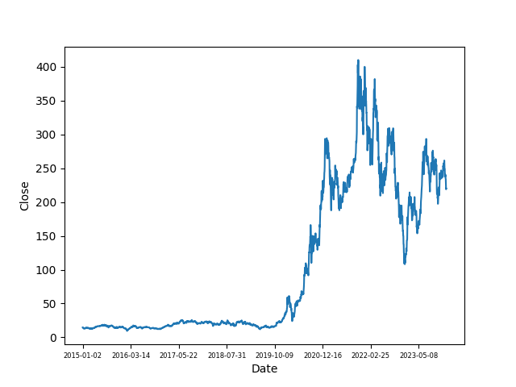

# Seaborn

### Advantages :

1. Data Visualization Library
2. Better than Matplotlib => It auto find out the differneces in plots and plots them giving different colors and symbols no need for us to mention them
3. Seaborn also have some built-in datasets

### Importing Seaborn

```python
import seaborn as sns
```

# Different plots available in seaborn

## 1. Relational Data

**Scatter plots and line plots for relationships between two variables:**

- **`scatterplot()`**: Use for visualizing the relationship between two numeric variables.
  - Example: Exploring the relationship between height and weight.
- **`lineplot()`**: Use for trends over time or ordered data.
  - Example: Tracking stock prices over time.
- **`relplot()`**: A more flexible function that can create both scatter and line plots with faceting.
  - Example: Visualizing relationships across multiple subgroups.

## 2. Categorical Data

**Visualizing categorical variables:**

- **`stripplot()`**: Use for plotting a categorical scatter plot.
  - Example: Distribution of a numeric value across different categories.
- **`swarmplot()`**: Similar to `stripplot`, but points are adjusted to avoid overlap.
  - Example: Distribution of scores across different groups without overlap.
- **`boxplot()`**: Use for showing the distribution of a numeric variable across different categories with summary statistics (quartiles).
  - Example: Comparing the distribution of test scores across different classes.
- **`violinplot()`**: Combines aspects of boxplot and KDE plot to show data distribution.
  - Example: Comparing the density of scores across different categories.
- **`boxenplot()`**: Similar to boxplot, but better for larger datasets by showing more quantiles.
  - Example: Detailed distribution of sales data across regions.
- **`pointplot()`**: Use for plotting categorical data with point estimates and confidence intervals.
  - Example: Mean test scores across different schools with error bars.
- **`barplot()`**: Use for showing the central tendency of a numeric variable for different categories.
  - Example: Average income across different professions.
- **`countplot()`**: Use for counting the occurrences of each category.
  - Example: Count of different car models.

## 3. Distribution Data

**Visualizing the distribution of a single variable:**

- **`displot()`**: General-purpose distribution plot, can create histograms, KDE plots, and ECDF plots.
  - Example: Distribution of ages in a population.
- **`histplot()`**: Use for creating histograms.
  - Example: Frequency distribution of test scores.
- **`kdeplot()`**: Use for visualizing the kernel density estimate of a dataset.
  - Example: Density estimate of annual income.
- **`ecdfplot()`**: Use for visualizing the empirical cumulative distribution function.
  - Example: Cumulative distribution of response times.
- **`rugplot()`**: Use for adding small tick marks to the bottom of a plot to show the distribution.
  - Example: Adding rug ticks to a scatter plot for better data distribution understanding.

## 4. Matrix Plots

**Visualizing data matrices:**

- **`heatmap()`**: Use for displaying matrix-like data where values are represented with color.
  - Example: Correlation matrix of features in a dataset.
- **`clustermap()`**: Use for hierarchical clustering of rows and columns of a matrix.
  - Example: Clustering gene expression data.

## 5. Regression Data

**Visualizing regression models:**

- **`lmplot()`**: Use for plotting linear models with faceting options.
  - Example: Relationship between advertising spend and sales, separated by region.
- **`regplot()`**: Use for plotting a simple linear regression model.
  - Example: Relationship between height and weight with a regression line.
- **`residplot()`**: Use for checking the residuals of a regression model.
  - Example: Residual plot to diagnose a linear regression model.

## 6. Multi-Plot Grids

**Creating grids of plots:**

- **`FacetGrid`**: Use for plotting multiple subsets of data.
  - Example: Visualizing the relationship between variables across different subsets (like species in the Iris dataset).
- **`PairGrid`**: Use for plotting pairwise relationships in a dataset.
  - Example: Visualizing pairwise relationships between features in the Iris dataset.
- **`pairplot()`**: Simplified interface for `PairGrid`.
  - Example: Pairwise relationships in the Iris dataset.
- **`jointplot()`**: Use for plotting two-variable relationships with marginal distributions.
  - Example: Scatter plot of weight vs. height with histograms on the margins.

## 7. Timeseries Data

**Visualizing data over time:**

- **`lineplot()`**: Use for plotting time series data.
  - Example: Daily temperature changes over a month.

## 8. Error Bars

**Adding error bars to plots:**

- **`errorbar()`**: Use for adding error bars to various plots.
  - Example: Mean test scores with error bars showing standard deviation.

Seaborn also includes tools for customizing plots, such as color palettes (`color_palette()`), themes (`set_style()`, `set_context()`, `set_palette()`), and more.

## Loading the dataset 'tips' from seaborn (RELPLOT)

```python
import seaborn as sns

# Importing 'tips' dataset from seaborn

tips = sns.load_dataset('tips')

print(tips.head())      # printing first 5 rows
```

#### Output

|     | total_bill | tip  | sex    | smoker | day | time   | size |
| --- | ---------- | ---- | ------ | ------ | --- | ------ | ---- |
| 0   | 16.99      | 1.01 | Female | No     | Sun | Dinner | 2    |
| 1   | 10.34      | 1.66 | Male   | No     | Sun | Dinner | 3    |
| 2   | 21.01      | 3.50 | Male   | No     | Sun | Dinner | 3    |
| 3   | 23.68      | 3.31 | Male   | No     | Sun | Dinner | 2    |
| 4   | 24.59      | 3.61 | Female | No     | Sun | Dinner | 4    |

Now we plot this data using seaborn

```python
import seaborn as sns
import matplotlib.pyplot as plt

# Importing 'tips' dataset from seaborn

tips = sns.load_dataset('tips')

# shows the first five rows of dataset
print(tips.head())

# data: Specifies the DataFrame containing the dataset to be used for plotting. Here, it is tips.
# x: Defines the variable to be plotted on the x-axis, which in this case is total_bill.
# y: Defines the variable to be plotted on the y-axis, which in this case is tip.
# col: Splits the plot into multiple columns based on the unique values of the specified column. Here, col='time' creates separate plots for lunch and dinner.
# hue: Uses the specified column to differentiate data points by color. Here, hue='smoker' colors points differently based on whether the customer is a smoker or not.
# style: Uses the specified column to differentiate data points by marker style. Here, style='smoker' assigns different marker styles to smokers and non-smokers.
# size: Uses the specified column to determine the size of the data points. Here, size='size' adjusts the size of the points based on the size of the dining party.

# Creates a relational plot
sns.relplot(data=tips, x='total_bill', y='tip',col='time',hue='smoker',style='smoker',size='size')
plt.show()
```

#### Output


To show the plot more pleasing we use set_theme which gives the plot a grid format to it

```python
# Gives a grid format to the plot
sns.set_theme()
```

#### Output

.png>)

## Loading the dataset 'iris' from seaborn (SCATTERPLOT)

This can be done using pandas and sklearn also but seaborn reduces the lines of code this way

```python
# Loading using sklearn and pandas
import pandas as pd
from sklearn.datasets import load_iris

iris_dataset = load_iris()

iris_df = pd.DataFrame(iris_dataset.data, columns=iris_dataset.feature_names)
print("\n", iris_df.head())

# Loading using seaborn
import seaborn as sns
Loading the iris dataset

iris = sns.load_dataset('iris')
print(iris.head())
```

#### Output

|     | sepal_length | sepal_width | petal_length | petal_width | species |
| --- | ------------ | ----------- | ------------ | ----------- | ------- |
| 0   | 5.1          | 3.5         | 1.4          | 0.2         | setosa  |
| 1   | 4.9          | 3.0         | 1.4          | 0.2         | setosa  |
| 2   | 4.7          | 3.2         | 1.3          | 0.2         | setosa  |
| 3   | 4.6          | 3.1         | 1.5          | 0.2         | setosa  |
| 4   | 5.0          | 3.6         | 1.4          | 0.2         | setosa  |

### Plotting the above data using Seaborn

```python
import seaborn as sns
import matplotlib.pyplot as plt

iris = sns.load_dataset('iris')
print(iris.head())

sns.scatterplot(data=iris, x='sepal_length', y='petal_length', hue='species', style='species')
plt.show()
```

#### Output


## Loading the dataset 'titanic' from seaborn (COUNTPLOT & BARPLOT)

```python
import seaborn as sns
import matplotlib.pyplot as plt

# Loading the titanic dataset
titanic = sns.load_dataset('titanic')

print(titanic.head())
```

#### Output

| survived | pclass | sex    | age  | sibsp | parch | fare    | embarked | class | who   | adult_male | deck | embark_town | alive | alone |
| -------- | ------ | ------ | ---- | ----- | ----- | ------- | -------- | ----- | ----- | ---------- | ---- | ----------- | ----- | ----- |
| 0        | 3      | male   | 22.0 | 1     | 0     | 7.2500  | S        | Third | man   | True       | NaN  | Southampton | no    | False |
| 1        | 1      | female | 38.0 | 1     | 0     | 71.2833 | C        | First | woman | False      | C    | Cherbourg   | yes   | False |
| 1        | 3      | female | 26.0 | 0     | 0     | 7.9250  | S        | Third | woman | False      | NaN  | Southampton | yes   | True  |
| 1        | 1      | female | 35.0 | 1     | 0     | 53.1000 | S        | First | woman | False      | C    | Southampton | yes   | False |
| 0        | 3      | male   | 35.0 | 0     | 0     | 8.0500  | S        | Third | man   | True       | NaN  | Southampton | no    | True  |

### Plotting the countplot of above data in bar graphs

```python
# Countplot => shows the number of people in each class
sns.countplot(data=titanic, x='class')
plt.show()

# shows the number of people survived
sns.countplot(data=titanic, x='survived')
plt.show()

# shows the number of people alive
sns.countplot(data=titanic, x='alive')
plt.show()

# shows the number of people who are male or female
sns.countplot(data=titanic, x='sex')
plt.show()
```

#### Output


### This means majority of people in titanic were in third clas, then the first class and the least were of second class.


### This means that majority of people died and a few survived.


### this means that majority of people had died now and only few are alive.


### This means most of the people in titanic were males and few were females.

### Plotting the data using the barplot

```python
import seaborn as sns
import matplotlib.pyplot as plt

# Loading the titanic dataset
titanic = sns.load_dataset('titanic')

# Barplot => using different bars to plot a data
sns.barplot(data=titanic, x="sex", y='survived',hue='class')
plt.show()
```

#### Output


## Loading the dataset 'california_housing' from sklearn and using seaborn for plots (DISTRIBUTION PLOT)

```python
from sklearn.datasets import fetch_california_housing
import pandas as pd
import seaborn as sns
import matplotlib.pyplot as plt

california_dataset = fetch_california_housing()

california_df = pd.DataFrame(california_dataset.data, columns=california_dataset.feature_names)
california_df['Price'] = california_dataset.target

print(california_df.head())
```

#### Output

| MedInc | HouseAge | AveRooms | AveBedrms | Population | AveOccup | Latitude | Longitude | Price |
| ------ | -------- | -------- | --------- | ---------- | -------- | -------- | --------- | ----- |
| 8.3252 | 41.0     | 6.984127 | 1.023810  | 322.0      | 2.555556 | 37.88    | -122.23   | 4.526 |
| 8.3014 | 21.0     | 6.238137 | 0.971880  | 2401.0     | 2.109842 | 37.86    | -122.22   | 3.585 |
| 7.2574 | 52.0     | 8.288136 | 1.073446  | 496.0      | 2.802260 | 37.85    | -122.24   | 3.521 |
| 5.6431 | 52.0     | 5.817352 | 1.073059  | 558.0      | 2.547945 | 37.85    | -122.25   | 3.413 |
| 3.8462 | 52.0     | 6.281853 | 1.081081  | 565.0      | 2.181467 | 37.85    | -122.25   | 3.422 |

### Plotting some data from above table using Distribution plot

```python
from sklearn.datasets import fetch_california_housing
import pandas as pd
import seaborn as sns
import matplotlib.pyplot as plt

california_dataset = fetch_california_housing()

california_df = pd.DataFrame(california_dataset.data, columns=california_dataset.feature_names)
california_df['Price'] = california_dataset.target

print(california_df.head())
sns.theme()

# Displot (Plots only the distribution)
sns.displot(data=california_df['Price'])
plt.show()
```

#### Output


### This plot tells us that most of the houses are in the range of 100,000 to 200,000 USD and around 500,000 USD.

### Earlier a similar function named distplot was used in seaborn which is deprecated now. It plots the distribution plot like above with the kernel density estimation. Output and code to it is as following

```python
from sklearn.datasets import fetch_california_housing
import pandas as pd
import seaborn as sns
import matplotlib.pyplot as plt

california_dataset = fetch_california_housing()

california_df = pd.DataFrame(california_dataset.data, columns=california_dataset.feature_names)
california_df['Price'] = california_dataset.target

print(california_df.head())
sns.set_theme()

# Distplot (Plots the distribution as well as the kernel density estimation kde but it is deprecated)
sns.distplot(california_df['Price'])
plt.show()
```

#### Output


### To plot both the distribution and the kde we use histplot

```python
from sklearn.datasets import fetch_california_housing
import pandas as pd
import seaborn as sns
import matplotlib.pyplot as plt

california_dataset = fetch_california_housing()

california_df = pd.DataFrame(california_dataset.data, columns=california_dataset.feature_names)
california_df['Price'] = california_dataset.target

print(california_df.head())
sns.set_theme()

# Histplot (Plots the distribution as well as the kernel distribution estimation kde)
sns.histplot(data=california_df['Price'], kde=True)
plt.show()
```

#### Output


## Constructing a Heat Map from correlation of pandas dataframe

1.  Finding the correlation first

```python
from sklearn.datasets import fetch_california_housing
import pandas as pd
import seaborn as sns
import matplotlib.pyplot as plt

california_dataset = fetch_california_housing()

california_df = pd.DataFrame(california_dataset.data, columns=california_dataset.feature_names)
california_df['Price'] = california_dataset.target

print(california_df.head())

# Finding the correlation of this dataframe
california_correlate = california_df.corr()
print(california_correlate)
```

#### Output

|                | MedInc    | HouseAge  | AveRooms  | AveBedrms | Population | AveOccup  | Latitude  | Longitude | Price     |
| -------------- | --------- | --------- | --------- | --------- | ---------- | --------- | --------- | --------- | --------- |
| **MedInc**     | 1.000000  | -0.119034 | 0.326895  | -0.062040 | 0.004834   | 0.018766  | -0.079809 | -0.015176 | 0.688075  |
| **HouseAge**   | -0.119034 | 1.000000  | -0.153277 | -0.077747 | -0.296244  | 0.013191  | 0.011173  | -0.108197 | 0.105623  |
| **AveRooms**   | 0.326895  | -0.153277 | 1.000000  | 0.847621  | -0.072213  | -0.004852 | 0.106389  | -0.027540 | 0.151948  |
| **AveBedrms**  | -0.062040 | -0.077747 | 0.847621  | 1.000000  | -0.066197  | -0.006181 | 0.069721  | 0.013344  | -0.046701 |
| **Population** | 0.004834  | -0.296244 | -0.072213 | -0.066197 | 1.000000   | 0.069863  | -0.108785 | 0.099773  | -0.024650 |
| **AveOccup**   | 0.018766  | 0.013191  | -0.004852 | -0.006181 | 0.069863   | 1.000000  | 0.002366  | 0.002476  | -0.023737 |
| **Latitude**   | -0.079809 | 0.011173  | 0.106389  | 0.069721  | -0.108785  | 0.002366  | 1.000000  | -0.924664 | -0.144160 |
| **Longitude**  | -0.015176 | -0.108197 | -0.027540 | 0.013344  | 0.099773   | 0.002476  | -0.924664 | 1.000000  | -0.045967 |
| **Price**      | 0.688075  | 0.105623  | 0.151948  | -0.046701 | -0.024650  | -0.023737 | -0.144160 | -0.045967 | 1.000000  |

2.  Plotting this correlation

```python
from sklearn.datasets import fetch_california_housing
import pandas as pd
import seaborn as sns
import matplotlib.pyplot as plt

california_dataset = fetch_california_housing()

california_df = pd.DataFrame(california_dataset.data, columns=california_dataset.feature_names)
california_df['Price'] = california_dataset.target

print(california_df.head())

# Finding the correlation of this dataframe
california_correlate = california_df.corr()
print(california_correlate)

sns.heatmap(data=california_correlate)
plt.show()
```

#### Output


### This is the heatmap which does not include any parameters just the data to make it more eye appealing seaborn provides some parameters which makes it better than the above plot

```python
from sklearn.datasets import fetch_california_housing
import pandas as pd
import seaborn as sns
import matplotlib.pyplot as plt

california_dataset = fetch_california_housing()

california_df = pd.DataFrame(california_dataset.data, columns=california_dataset.feature_names)
california_df['Price'] = california_dataset.target

print(california_df.head())
sns.set_theme()

# Finding the correlation of this dataframe
california_correlate = california_df.corr()
print(california_correlate)

# Heatmap using params provided by seaborn

# Adjusting the figure size to fit
fig,ax = plt.subplots(figsize=(9,8))

# cbar makes the bar show with different colors, square makes the size of the cells as square, annot makes the annotations inside the cells true, annot_kws helps to style the annotation keywords (color,size,etc.), cmap is used for colormappping of the cells and fmt is used for formatting the annot keywords .3f means till 3 decimal places.

sns.heatmap(data=california_correlate, cbar=True, annot=True, annot_kws={'size':8}, cmap='Blues', square=True, fmt= '.3f')
plt.show()
```

#### Output


## Loading the csv file for 'tesla stock price' and using seaborn for plotting it (LINEPLOT)

```python
import seaborn as sns
import pandas as pd
import matplotlib.pyplot as plt

tesla_df = pd.read_csv("C:\Machine Learning\DataSets\Tasla_Stock_Updated_V2.csv")

print(tesla_df.head())
```

#### Output

| Unnamed: 0 | Date       | Open      | High      | Low       | Close     | Volume   |
| ---------- | ---------- | --------- | --------- | --------- | --------- | -------- |
| 0          | 2015-01-02 | 14.858000 | 14.883333 | 14.217333 | 14.620667 | 71466000 |
| 1          | 2015-01-05 | 14.303333 | 14.433333 | 13.810667 | 14.006000 | 80527500 |
| 2          | 2015-01-06 | 14.004000 | 14.280000 | 13.614000 | 14.085333 | 93928500 |
| 3          | 2015-01-07 | 14.223333 | 14.318667 | 13.985333 | 14.063333 | 44526000 |
| 4          | 2015-01-08 | 14.187333 | 14.253333 | 14.000667 | 14.041333 | 51637500 |

### Plotting the above data using LINEPLOT

```python
import seaborn as sns
import pandas as pd
import matplotlib.pyplot as plt

tesla_df = pd.read_csv("C:\Machine Learning\DataSets\Tasla_Stock_Updated_V2.csv")

print(tesla_df.head())

sns.lineplot(data=tesla_df, x='Date', y='Close')
plt.xticks(fontsize=6)
# sets the fontsize of x labels as 6
plt.gca().xaxis.set_major_locator(plt.MaxNLocator(10))
# gca => get current axes, then select xaxis, MaxNLocator => maximum labels to be shown
plt.show()
```

#### Output


